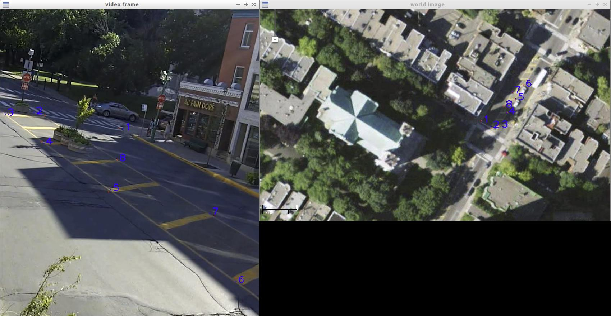

For complete information and a recent method to calibrate a camera (see OpenCV documentation for example for a description of the pinhole camera model), you may look at the paper Ismail, K.; Sayed, T. & Saunier, N. A Methodology for Precise Camera Calibration for Data Collection Applications in Urban Traffic Scenes Canadian Journal of Civil Engineering, 2013, 40, 57-67.

Traffic intelligence feature-based tracking algorithm relies only on a homography to project from the camera image space to the real world ground plane (assuming the ground level can be approximated by a plane). The homography is a 3x3 matrix that can be estimated from at least 4 non-colinear points visible in the field of view, with known coordinates. The typical method is to obtain an aerial view of the site with a known scale (through sites such as Google Maps) and to select pairs of corresponding points in both images. 

The `compute-homography.py` script is provided for that purpose in the `scripts` directory in the repository. The script options can be obtained through the `-h` or `--help` options. The requirements are a video frame (where enough points of interest are visible), say `image.png`, and an aerial photo, say `world.png`, with known scale. The script should then be started with

```
$ compute-homography.py -i image.png -w world.png -n npoints -u unitpixelratio
```

where `npoints` is the number of corresponding points (can be omitted and will be 4 by default) and `unitpixelratio` is the number of units of distance per pixel (eg 10 cm per pixel). The resulting coordinates will be in the same unit of distance. Before starting the script, think of the points that you will select. The script then lets you select the points in image space then the same points in world space, in the *same order*. The script will output the point-correspondence file (format in script help) and the homography. Be careful, if you do it several times, your previous output files will be overwritten (save them by changing their names). Finally, it is important to pick points covering the whole area of interest for tracking, to ensure good enough accuracy. Errors may increase quickly away from calibration points. 

You may also create manually the point-correspondence file and generate the homography from it (you can also add points this way if you are not happy with the current homography: save the current points correspondences, start the script again, and combine at will the corresponding points). 

As an example, you may use the `laurier-frame.png` and `laurier-world.png` from the Download page (in the zip archive [laurier.zip](https://bitbucket.org/Nicolas/trafficintelligence/downloads/12-laurier.zip), you can try it as follows:

```
$ compute-homography.py -i laurier-frame.png -w laurier-world.png -n 4 -u 0.208333
```

You can see, as shown below, the points used to obtain the provided homography matrix (stored in `laurier-homography.txt`) using the provided point correspondence file `point-correspondences.txt` by typing `compute-homography.py -i laurier-frame.png -w laurier-world.png -p point-correspondences.txt --display -u 0.208333` (these points are far from perfect as they do not cover the whole area that we may want to track). 



If you are correcting the camera distortion, you have to provide the necessary information (camera matrix and distortion coefficient) when computing the homography, which will be between the corrected image (in ideal point coordinates, non scaled as if seen by a camera) and the world plane. Sample calibrated camera matrices and coefficient coefficients are provided on http://www.polymtl.ca/wikitransport/index.php?title=Equipment#Camera_Matrices_and_Distortion_Coefficients and in metadata files (to be added). 

## To Rewrite and Improve
Information on mask, camera distortion, extracting frames.
* use a video player, like VLC, to record a given image from a video (VLC -> Pause video at a good frame (without many vehicles hiding the identified points -> Video menu -> Take Snapshot; usually stored in the Pictures folder)
* A mask file an image in the exact same resolution as the video (even if correcting for distortion). White pixels correspond to tracking, black to no tracking. To generate it, I typically use and recommend an image manipulation program with layers a la Photoshop, eg Paint.net on Windows and GIMP on Linux. Without a mask, one is wasting computation time. In some cases, it is useful to ignore some areas where one does not want tracking (for example if one is interested by traffic in only one direction). 
** **important warning**: in some cases, with camera distortion correction, tracking cannot be done in the periphery of the image (close to the borders) and should be verified with the undistort-video.py script; clearly erroneous high speeds are often related to such errors. 
* The following parameters need to be set only if correcting for distortion (setting the undistort option to true when tracking): intrinsic camera and distortion coefficients (undistorted-multiplication is used only for display).
