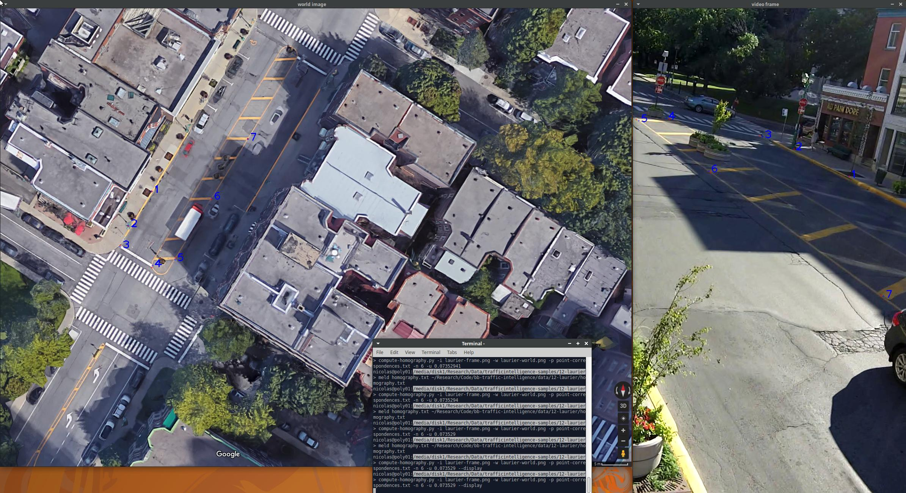

# Camera Calibration
For complete information and a recent method to calibrate a camera (see OpenCV documentation for example for a description of the pinhole camera model), you may look at the paper Ismail, K.; Sayed, T. & Saunier, N. A Methodology for Precise Camera Calibration for Data Collection Applications in Urban Traffic Scenes Canadian Journal of Civil Engineering, 2013, 40, 57-67.

Traffic intelligence feature-based tracking algorithm relies only on a homography to project from the camera image space to the real world ground plane (assuming the ground level can be approximated by a plane). The homography is a 3x3 matrix that can be estimated from at least 4 non-colinear points visible in the field of view, with known coordinates. The typical method is to obtain an aerial view of the site with a known scale (through sites such as Google Maps) and to select pairs of corresponding points in both images. 

The `compute-homography.py` script is provided for that purpose in the `scripts` directory in the repository. The script options can be obtained through the `-h` or `--help` options. The requirements are a video frame (where enough points of interest are visible), say `image.png`, and an aerial photo, say `world.png`, with known scale. Typically, media players can be used to save a single image (frame) from the video recording. Using VLC, pause the video at a desired frame (ideally, without many vehicles hiding the identified points) and save the image. In the "Video" tab, select "Take Snapshot" (the image is usually stored in the Pictures folder). You **cannot** do a screen shot simply of your screen, the resolution will be **wrong**. 

The script should then be started with

```
$ compute-homography.py -i image.png -w world.png -n npoints -u unitpixelratio
```

where `npoints` is the number of corresponding points (can be omitted and will be 4 by default) and `unitpixelratio` is the number of units of distance per pixel (eg 10 cm per pixel). The resulting coordinates will be in the same unit of distance. Before starting the script, think of the points that you will select. The script then lets you select the points in image space then the same points in world space, in the *same order*. The script will output the point-correspondence file (format in script help) and the homography. Be careful, if you do it several times, your previous output files will be overwritten (save them by changing their names). Finally, it is important to pick points covering the whole area of interest for tracking, to ensure good enough accuracy. Errors may increase quickly away from calibration points. 

You may also create manually the point-correspondence file and generate the homography from it (you can also add points this way if you are not happy with the current homography: save the current points correspondences, start the script again, and combine at will the corresponding points). 

As an example, you may use the `laurier-frame.png` and `laurier-world.png` from the Download page (in the zip archive [laurier.zip](../data/12-laurier.zip), you can try it as follows (with 5 m corresponding to 68 pixels):

```
$ compute-homography.py -i laurier-frame.png -w laurier-world.png -n 4 -u 0.073529
```

You can see, as shown below, the points used to obtain the provided homography matrix (stored in `laurier-homography.txt`) using the provided point correspondence file `point-correspondences.txt` by typing `compute-homography.py -i laurier-frame.png -w laurier-world.png -p point-correspondences.txt --display -u 0.208333` (these points are far from perfect as they do not cover the whole area that we may want to track). 



If you are correcting the camera distortion, you have to provide the necessary information (camera matrix and distortion coefficient) when computing the homography, which will be between the corrected image (in ideal point coordinates, non scaled as if seen by a camera) and the world plane. Sample calibrated camera matrices and coefficient coefficients are provided further below and in metadata files (to be added). 

Note that in this case, it is not as straightforward to manually create the point-correspondence file. One way is to use the compute-homography script to generate the image points in ideal space coordinates, regardless where one clicks in world space. Another is to use coordinates in image space and use the `--correspondences-imagepoints-in-image-space` option to generate the correct homography (from ideal point space to world space).

To speed up the image processing, a mask can be defined to define the area of interest. The mask file should have the same resolution as the video frames and should be composed only of black and white pixels. Without a mask, one is wasting computation time and, in some cases, it is useful to ignore some areas where one does not want tracking (for example if one is interested by traffic in only one direction). 

Using a photo-editing software, a video frame can be used to create the mask. I typically use and recommend an image manipulation program with layers such as Photoshop, e.g. Paint.net on Windows and GIMP on Linux. The mask should be made in such a way that the white pixels correspond to the tracking area and black pixels the area to be discarded.

Using GIMP, simply open the frame, choose the "Free Select Tool", create a new layer (Ctrl+Shift+N), fill the area of interest using the "Bucket Fill Tool" (Shift+B) with white and, inverting the selection (Ctrl+I) and the selected colour, fill the discarded area with black.

**Warning**: in some cases, with camera distortion correction, tracking cannot be done in the periphery of the image (close to the borders) and should be verified with the undistort-video.py script; clearly erroneous high speeds are often related to such errors.

# Camera Matrices and Distortion Coefficients

In-use camera parameters in the format of the metadata implemented in the `metadata` library are available in the [camera_types.csv](../data/camera_types.csv) file. 

**Warning**: Validate these parameters on your data before using them. These are old model parameters. 

With GoPro cameras, verify the FOV setting. Not all versions support the same FOVs.

* Sample parameters for GoPro HD Hero2 1280*960 (In-house calibration), unknown FOV:

```
        camera_matrix = [[377.42, 0.0,     639.12],
                         [0.0,    378.43,  490.20],
                         [0.0,    0.0,     1.0]]
        dist_coeffs = [-0.11759321,  0.0148536,  0.00030756, -0.00020578, -0.00091816]
```

* Sample parameters for GoPro HD Hero2 1280*720 http://www.htw-mechlab.de/index.php/undistortion-der-gopro-hd-hero2/:

```        camera_matrix = [[469.96, 0.0,    640],
                         [0.0,    467.68, 360],
                         [0.0,    0.0,    1.0]]
        dist_coeffs = [-0.18957, 0.037319, 0.0, 0.0, -0.00337]
```

* Sample parameters for GoPro HD Hero2 1920*1080 (In-house calibration), wide FOV:

```    
        camera_matrix = [[ 894.18, 0.0,    951.75],
                         [   0.0,  913.20, 573.04],
                         [   0.0,  0.0,    1.0]]
        dist_coeffs   = [-0.35887,  0.16375, -0.00081, -0.00074, -0.04039]
```

* Sample parameters for GoPro HD Hero2 4K (In-house calibration):

```
        camera_matrix = [[  1.80151934e+03,   0.00000000e+00,   1.88663242e+03],
                         [  0.00000000e+00,   1.80423487e+03,   1.48375206e+03],
                         [  0.00000000e+00,   0.00000000e+00,   1.00000000e+00]]
         dist_coeffs = [ -3.41396353e-01,   1.70761088e-01,   1.85596892e-05,   6.56168307e-04,  -5.22716120e-02]
```

* Sample parameters for GoPro HD Hero3 White 1280*960 (In-house calibration), "Ultra-Wide" (?) FOV:

```
        camera_matrix = [[568.82, 0.0,     630.27],
                         [0.0,    565.51,  469.72],
                         [0.0,    0.0,     1.0]]
        dist_coeffs = [-0.25889354,  0.0812486 ,  0.00119071,  0.0044503 , -0.0119863]
```

* Sample parameters for GoPro HD Hero3 1280*720 (In-house calibration),  wide FOV:

```
   camera_matrix =[[ 843.83, 0.00,  939.77],
                   [ 0.00,   843.67, 547.26],
                   [ 0.00,   0.00,   1.00]]
   dist_coeffs = [-2.62630520e-01, 1.20270201e-01, 2.23896448e-04, -5.21657471e-04, -3.68401697e-02]
```

* Sample parameters for GoPro HD Hero4 black 1280*720 (In-house calibration), ultra wide FOV:

```
   camera_matrix =[[ 584.95, 0.00,   635.12],
                   [ 0.22,   584.42, 367.63],
                   [ 0.00,   0.00,   1.00]]
   dist_coeffs = [-0.26117408,  0.09197799, -0.00055912,  0.00033594, -0.01686286]
```