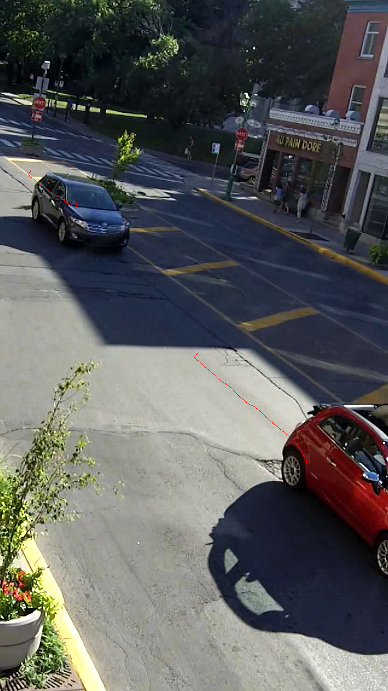

The objective of this tutorial is to present a step-by-step tutorial on the extraction of trajectory data from video data. Download the archive [12-laurier.zip](../data/12-laurier.zip) containing the necessary files for this example. 

* Choose a video file to process (.avi and .mp4 containers can be read by OpenCV, and the codecs have to be installed on the computer). For this tutorial, we will use as an example the `laurier.avi` video. 
* For better results (taking in particular into account the scene perspective), a homography (3x3 matrix) should be estimated for the projection of points in image space (in pixels) to points on the ground plane (typically in meters). Homography estimation from at least 4 non-collinear points with known coordinates in both spaces can be done using the provided script `scripts/compute-homography.py`, a video frame and an aerial photo with known scale. For this tutorial, you can use the provided homography `homography.txt` for the Laurier video. For more information on computing a homography, see the corresponding [tutorial](camera-calibration.md).
* Extracting road user trajectories relies on the `feature-based-tracking` program compiled from the C++ code (after successful compilation (see [[Compile the C++ Code|instructions]]), it should be in the bin subdirectory). This program takes option on the command line and from a configuration file (a default file `tracking.cfg` is provided in the main project directory). Options in the configuration file can be overridden when provided on the command line. The only positional argument of the program is the name of the configuration file: `$ bin/feature-based-tracking tracking.cfg [--option1 value1] ...`. All the options may be accessed by using the help option (adding `-h` or `--help`). A sample configuration file `tracking.cfg` for the Laurier video is provided in the archive. Extracting road user trajectories consists in two steps:
    * **Feature Tracking** consists in detecting specific points (good features to track) in each image and in tracking them from image to image, generating a large set of feature trajectories. This is done through the main option `--tf`: `$ bin/feature-based-tracking tracking.cfg --tf`. The main parameters are `feature-quality`, `min-feature-distanceklt`, `window-size`, `ndisplacements` and `min-feature-displacement` (defined in the configuration file). The results (positions and velocities) are stored in a SQLite database (`database-filename` option). 
    * **Feature Grouping**: several features belong to the same road user and must therefore be grouped together. This is done through the main option `--gf`: `$ bin/feature-based-tracking tracking.cfg --gf`. The features must be close enough (less than `mm-connection-distance` at their first instant of co-existence) and have similar motions (the difference between the maximum and minimum distance must be less than `mm-segmentation-distance`). The results are stored in the same database, as groups of feature trajectories. Users are referred to the [CRV 2006 paper](http://n.saunier.free.fr/saunier/stock/saunier06feature-based.pdf) for more details on the feature-based tracking algorithm. 
* The resulting data can be accessed using the Python modules, eg the loading functions in the `storage` module (see corresponding guide). The script `scripts/display-trajectories.py` can be used to replay the video with the feature or road user trajectories overlaid up to the current frame, eg using the provided sample result database `laurier.sqlite`: `python path/to/scripts/display-trajectories.py -i laurier.avi -d laurier.sqlite -o homography.txt -t object` (the `-t` option can be either feature or object to display feature or road user trajectories) (use `-h` for other options). An example image of road user trajectories overlaid over the video image is provided below. 

Here are finally some elements to understand the tracking parameters (that can be provided in the configuration file or on the command line):

* The feature detection and tracking parameters are the same as the two OpenCV functions on which they are based (with similar names):
    * [goodFeaturesToTrack](https://docs.opencv.org/4.5.0/dd/d1a/group__imgproc__feature.html#ga1d6bb77486c8f92d79c8793ad995d541)
    * [calcOpticalFlowPyrLK](http://docs.opencv.org/4.5.0/dc/d6b/group__video__track.html#ga473e4b886d0bcc6b65831eb88ed93323)
* The other important parameters are the grouping parameter, connection and segmentation distance, and can be understood from the [CRV 2006 paper](http://n.saunier.free.fr/saunier/stock/saunier06feature-based.pdf). If a homography is provided, the connection and segmentation parameters are in the same distance units and directly measure that features are connected to each other when detected, and the threshold over the difference between the maximum and minimum feature distances will disconnect two features, ie put them in two different objects). So the connection distance should be of the order of magnitude of the object of interest, eg 2 m for a car, and segmentation distance should be lower). 

To evaluate performance, see [[Tracking Performance|tracking performance]].

* P. Morse, P. St-Aubin, L. F. Miranda-Moreno, and N. Saunier. Transferability study of video tracking optimization for traffic data collection and analysis. In Transportation Research Board Annual Meeting Compendium of Papers, 2016. 16-6810
